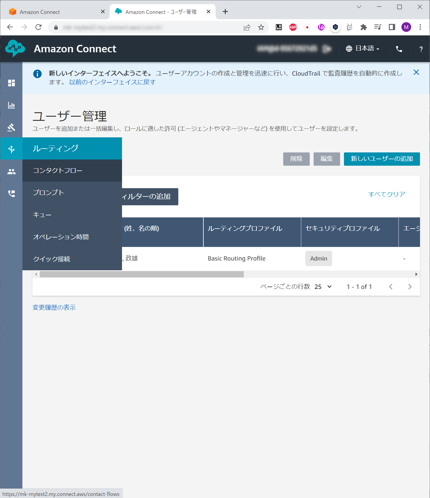

# 手動でAmazonConnectを作ってみる

1. AWSマネージメントコンソールにログインする
2. `Amazon Connect`コンソールを開く
3. インスタンスを作成する
    * ID管理を設定
      * `Amazon Connectでユーザーを作成及び管理`を選択
      * `アクセスURL`に一意の名前を設定する
      * 
    * 管理者を追加
      * ここで言う管理者は、コンタクトセンターの管理者という意味
      * 後で設定するので`管理者なし`を選択
      * 
    * テレフォニーを設定
      * デフォルトでOK
      * 
    * データストレージ
      * デフォルトでOK
      * 
    * 確認して下部にある作成を押す
      * 
4. 出来上がるまでしばし待つ
   * 上部の`今すぐ始める`を押す
   * 
   * `今すぐ始める`を消してしまった場合、インスタンスエイリアスを選択し、表示される`Emergency access`を押す
   * 
5. Amazon Connectにアクセスできるので、`今すぐ始める`を押す
    
6. 電話番号の取得画面になるので、`+1(米国)`かつ`DID`を選択し、表示される電話番号から好きなものを選択する
    
    * SCSKの中の人が詳しく書いてくれています
        https://blog.usize-tech.com/amazon-connect-starter/
    * 昔は、日本の電話番号を簡単に取得できたが、今はできなくなっています
      * 個人アカウントではそもそも取得できなくなりました
      * またサポートケースを起票して、公的証明書を提出しないといけません
      * また、Connectから発信する場合、日本の携帯電話番号(070,080.090)への架電はデフォルトで許可されていないため緩和申請を行う必要があります。
    * デモでは米国への国際通話をするので、長電話に気をつけましょう
7. `Continue`を押す

8. 左のメニューから`ユーザ管理`を押す

9. `新しいユーザーの追加`を押す

10. ユーザ情報を入力し、`保存`を押す
    * 名: 任意
    * 姓: 任意
    * ログイン: 任意
    * Eメールアドレス: 任意
    * パスワード: 任意
    * セキュリティプロファイル: Admin
    * ルーティングプロファイル: Basic Routing Profile
    
11. 左メニューから`コンタクトフロー`を選択する

12. 最後の図のようになるように、設定する。
  * ドラッグアンドドロップで要素を配置
  * 要素の上でドラッグし、別の要素まで引っ張ると接続される
  * 要素の左上のアイコンをクリックすると、要素の設定が表示される
    * フローの設定
      * エントリー
      * [設定]->[音声の設定] (日本語/Mizuki、言語属性を設定)
      * [インタラクション]->[プロンプトの再生]
        * [成功] -> [顧客の入力を取得する]
        * [エラー] -> [切断]　
      * [インタラクション] -> [顧客の入力を取得する]
        * 「何課かを入力してください]
        * 条件を追加
          * [1が押されました] -> [プロンプトの再生](第一課)
          * [2が押されました] -> [プロンプトの再生](第二課)
          * [タイムアウト] -> [プロンプトの再生](リトライ)
          * [デフォルト]-> [プロンプトの再生](リトライ)
          * [エラー] -> [切断]
      * [インタラクション]->[プロンプトの再生]
        * 「入力が読み取れませんでした」
        * [成功] -> [顧客の入力を取得する]
        * [エラー] -> [切断]
      *  [インタラクション] -> [プロンプトの再生]
         *  「第一課へようこそ！」
         *  [成功] -> [切断]
         *  [エラー] -> [切断]
      *  [インタラクション] -> [プロンプトの再生]
         *  「第二課へようこそ！」
         *  [成功] -> [切断]
         *  [エラー] -> [切断]
      * [終了] -> [切断]
  * 左上の名前を入力に「WelcomeToRDC」と入力
  * 右上の「保存」押す
  * 右上の「公開」を押す

    
    
    
    
13. `電話番号`に戻り、電話番号のリンクを開く
    * `問い合わせ/IVR`で先程作成した`WelcomeToRDC`を選択する
      * これでこの電話番号に通話した場合、`WelcomeToRDC`のコンタクトフローが実行されるようになる
14. 右上の「電話」のアイコンをクリックする
    * ソフトフォンの画面が表示される
      * 電話をかけたり、この画面で応答できる
      * この画面で、自身の取得した電話番号に通話してみる
      * 入力を促されたら、「数値パッド」で1か2を入力する
    * 可能だったら、自分の携帯電話から自身の取得した電話番号に通話する
      * 国際通話をかける際は、0を長押しすると'+'がでるので、その後入力する
15. (片付け) Amazon Connectのコンソールに戻り、インスタンスを終了する