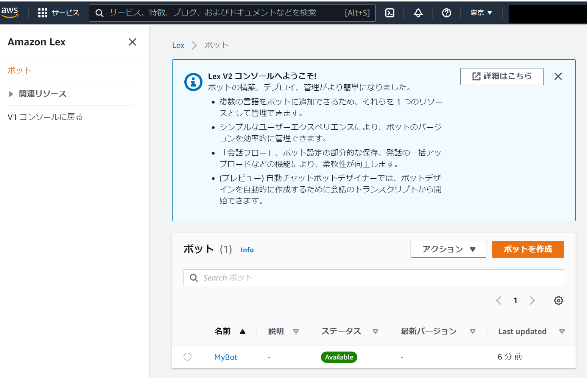
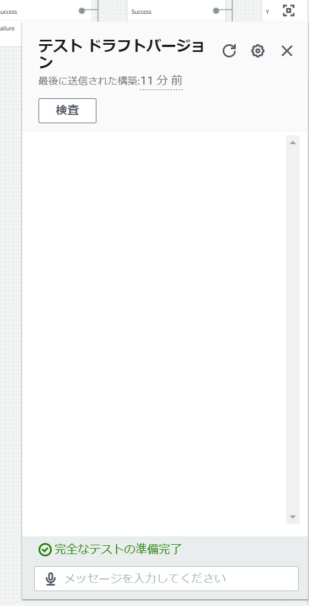
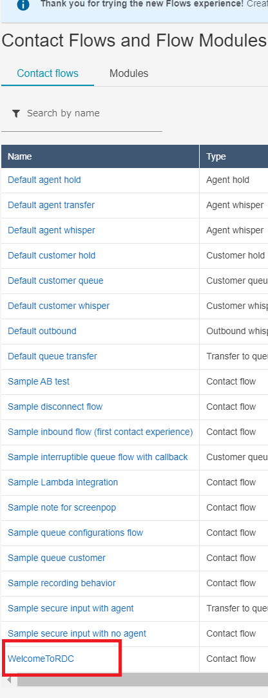
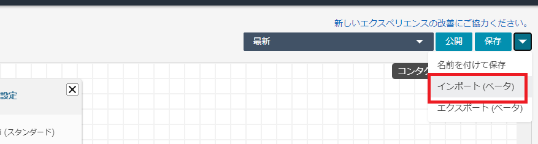
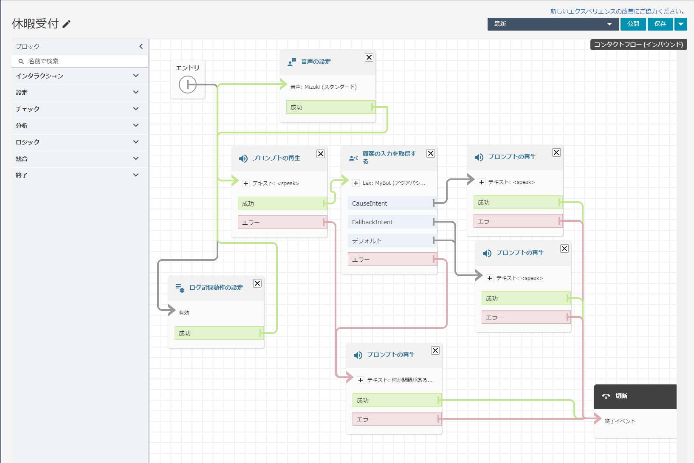
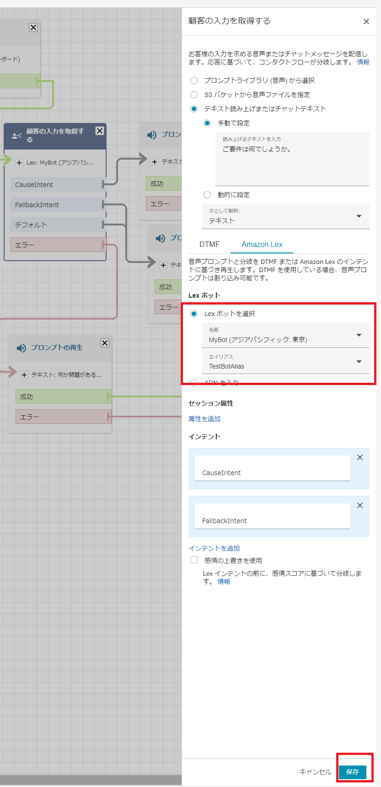

# Amazon Lexとの接続を試す

* Serverless Framework (CloudFormation)で`1.md`の内容と必要なリソースを自動作成します

1. `Amazon Cloud9`にアクセスし、インスタンスを作成する
    t3.mediumのマシンで。あとはデフォルトでOK。
2. `Amazon Cloud9`のコンソールで下記を入力し、Serverless Frameworkをインストールする。
    ```bash
    npm install -g serverless
    ```
3. このリポジトリをクローンし、カレントディレクトを移動しておく
   ```bash
   git clone https://github.com/maskinoshita/connect-lex-demo.git
   cd connect-lex-demo
   ```
4. `serverless.yml`を開いて、`SUFFIX: "mk"`のmkの部分を別の一意の名前に変更する
5. `sls deploy`を実行する
6. `Amazon Lex`のコンソールに移動する
   * Serverless Frameworkで予め作成したボットが登録されています
   * 
7. `ドラフトバージョン`の下の`インテント`、`スロットタイプ`を確認してください
   * Intent/Utterance/Slotなどを確認してください
8. テキストチャットで動作を確認します
   * `右上`のテストを押してください
   * 
   * "休みたい"という内容の文章を打ってみてください
   * 「理由」と「日にち」のSlotがうまるとIntent終了の確認がされます
   * 最後に"了承"の旨を表す内容を打つと、Intentが終了します (Fullfillment)
   * 今回はやりませんが、Intentの後段にLambda関数を設定することで、取得したSlotを使った処理ができます
     * Lambdaで休暇情報をDynamoDBに登録しておくなど
9. Lexの確認が終わったら、Connectに接続させるので、Connectのコンソールに移動(`Emergency Access`)してください
10. `Contact Flow`から`WelcomeToRDC`を選択します
    * 今回は新規で作らずに、既存コンタクトフローを変更します
    * 
11. 右上の`インポート(ベータ)`を押し、リポジトリ内にある`ContactFlow_dayoff.template.json.txt`を選択してください
    

12.  完了すると、コンタクトフローが変更されます
* 
13. 一部変更が必要です
    * 中央の`顧客の入力を取得する`
      * Lexボットの`名前`と`エイリアス`を変更する
      * 
14. コンタクトフローの`保存`と`公開`を実行する
15. 実際に電話をかけてみる
    電話番号は、Cloud9で`sls info --verbose`で表示される`MyPhoneNumber`
16. (片付け) Cloud9で`sls remove`
    * Cloud9の必要なら削除してください
    * CloudWatchロググループにカスタムリソースのログが残ってしまうので、必要なら削除してください

お疲れ様でした